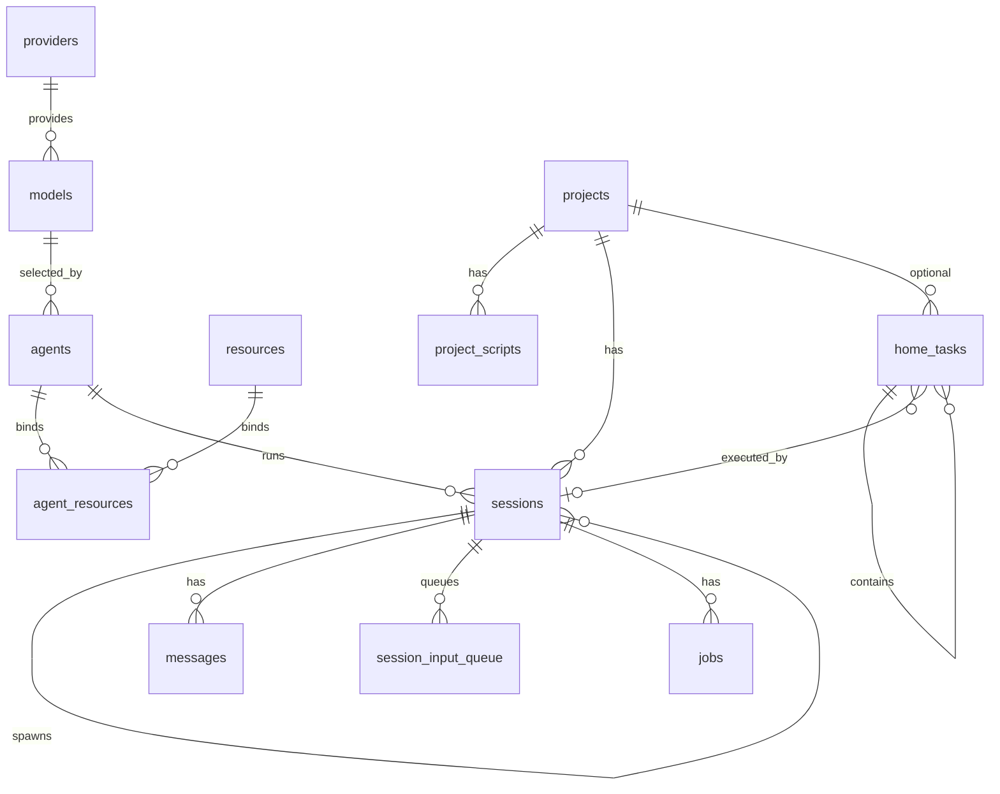

# Supervisor 数据库 Schema 参考（目标设计）

> 本文描述计划收敛后的目标结构，不代表当前源码已经完成迁移。
> 日期：2026-07-27。

## 设计原则

- 核心身份、展示和运行配置使用明确的列，不放入 `meta`。
- `meta` 只承载确实开放给扩展的动态数据，不保存核心字段或错误状态。
- 错误及诊断细节写日志；只有需要驱动业务状态的结果才进入结构化字段。
- 华生是内部 assistant runner，不是 Agent，不写入 `agents`，也不创建用户 Session。
- 目录字段统一使用 `home_dir` 表示 Supervisor 管理的专属目录；项目源码目录仍使用 `cwd`。

## 总览

| 表                    | 用途                              |
| --------------------- | --------------------------------- |
| `providers`           | API 供应商及凭据                  |
| `models`              | 可用模型目录                      |
| `agents`              | 用户可选择的 Agent 配置           |
| `projects`            | 项目及其源码、专属目录            |
| `project_scripts`     | 项目的 install/start/destroy 脚本 |
| `sessions`            | Agent 会话及派生关系              |
| `messages`            | 会话消息树                        |
| `messages_fts`        | 消息全文检索索引                  |
| `session_input_queue` | 会话输入队列                      |
| `home_tasks`          | 首页任务                          |
| `resources`           | skill/MCP/extension 资源目录      |
| `agent_resources`     | Agent 与资源绑定                  |
| `jobs`                | Session Job 执行记录              |

不再保留：`members`、`session_tasks`、`session_todos`、`extensions`、`job_schedules`，以及本文各表中未列出的旧字段。

## 1. `providers`

| 字段         | 类型 / 约束                | 功能             |
| ------------ | -------------------------- | ---------------- |
| `id`         | INTEGER PK AUTOINCREMENT   | 主键             |
| `slug`       | TEXT NOT NULL UNIQUE       | 稳定标识         |
| `name`       | TEXT NOT NULL              | 显示名           |
| `icon`       | TEXT                       | 图标             |
| `api_type`   | TEXT NOT NULL              | API 协议类型     |
| `base_url`   | TEXT                       | API Base URL     |
| `api_key`    | TEXT                       | 加密后的 API Key |
| `is_enabled` | INTEGER NOT NULL DEFAULT 1 | 是否启用         |
| `created_at` | INTEGER NOT NULL           | 创建时间（ms）   |
| `updated_at` | INTEGER NOT NULL           | 更新时间（ms）   |

## 2. `models`

| 字段              | 类型 / 约束                                          | 功能                 |
| ----------------- | ---------------------------------------------------- | -------------------- |
| `id`              | INTEGER PK AUTOINCREMENT                             | 主键                 |
| `provider_id`     | INTEGER NOT NULL → `providers(id)` ON DELETE CASCADE | 调用所需供应商       |
| `model_id`        | TEXT NOT NULL                                        | 供应商侧模型 ID      |
| `name`            | TEXT                                                 | 显示名               |
| `context_window`  | INTEGER NOT NULL DEFAULT 128000                      | 上下文窗口 token 数  |
| `supports_vision` | INTEGER NOT NULL DEFAULT 0                           | 是否支持图片输入     |
| `created_at`      | INTEGER NOT NULL                                     | 创建时间             |
| `updated_at`      | INTEGER NOT NULL                                     | 更新时间             |
|                   | UNIQUE(`provider_id`, `model_id`)                    | 同一供应商下模型唯一 |

删除 `tags`：当前没有稳定的分类或查询需求。删除 `max_tokens`：运行时没有用它限制输出，模型输出上限也更适合作为请求参数或供应商能力处理。将 `supports_multimodal` 改为 `supports_vision`，明确当前实际表达的是“可接收图片”，避免把音频、视频等能力也笼统算入。

## 3. `agents`

| 字段              | 类型 / 约束                               | 功能                                           |
| ----------------- | ----------------------------------------- | ---------------------------------------------- |
| `id`              | INTEGER PK AUTOINCREMENT                  | 主键                                           |
| `name`            | TEXT NOT NULL                             | 显示名                                         |
| `description`     | TEXT                                      | 简介                                           |
| `avatar`          | TEXT                                      | 头像                                           |
| `backend_type`    | TEXT NOT NULL DEFAULT `'native'`          | `native` / `codex` / `claude` / `kimi` / `acp` |
| `model_id`        | INTEGER → `models(id)` ON DELETE SET NULL | 直接绑定模型                                   |
| `system_prompt`   | TEXT                                      | Agent 的 system prompt 正文                    |
| `tools_preset`    | TEXT NOT NULL DEFAULT `'coding'`          | `coding` / `readonly` / `none`                 |
| `home_dir`        | TEXT                                      | Agent 专属目录                                 |
| `is_builtin`      | INTEGER NOT NULL DEFAULT 0                | 是否为内置 Agent                               |
| `external_config` | TEXT                                      | 外部 ACP 启动配置 JSON                         |
| `disabled_tools`  | TEXT NOT NULL DEFAULT `'[]'`              | 永久禁用的工具名 JSON 数组                     |
| `meta`            | TEXT NOT NULL DEFAULT `'{}'`              | 扩展命名空间数据                               |
| `created_at`      | INTEGER NOT NULL                          | 创建时间                                       |
| `updated_at`      | INTEGER NOT NULL                          | 更新时间                                       |

Agent 不再保存 `provider_id`：通过 `agents.model_id → models.id → providers.id` 可以确定供应商，避免双重绑定产生不一致。这里的 `model_id` 是本地模型表外键，不是供应商侧字符串；供应商侧标识仍为 `models.model_id`。

`system_prompt` 必须存正文并作为数据库真源，不读取 Agent Home 下的 `SYSTEM.md`。删除 `extension_id`：Agent 是独立配置，不与创建它的扩展建立持久归属关系；扩展如需管理自己的数据，应使用资源关系或带命名空间的扩展数据。

`tools_preset` 保留。它决定 Agent 默认获得可写工具、只读工具或不获得默认工具，是权限基线，不等同于 `disabled_tools` 的逐项排除。若未来改为完整的工具策略/能力绑定表，再迁移并删除该列。

删除 `icon`、`provider_id`、`spawn_type`。华生由 `featureModels.assistant` 驱动并通过内部 runner 执行，不进入 `agents`，因此不存在 `spawn_type = watson`。

### `agents.external_config`

```ts
{
  command: string;
  args?: string[];
  env?: Record<string, string>;
  permissionPolicy?: "allow_once" | "reject_once";
}
```

## 4. `projects`

| 字段          | 类型 / 约束              | 功能                               |
| ------------- | ------------------------ | ---------------------------------- |
| `id`          | INTEGER PK AUTOINCREMENT | 主键                               |
| `name`        | TEXT NOT NULL            | 显示名                             |
| `description` | TEXT                     | 项目简介                           |
| `cwd`         | TEXT NOT NULL UNIQUE     | 项目源码根目录                     |
| `home_dir`    | TEXT NOT NULL            | Supervisor 管理的 Project 专属目录 |
| `created_at`  | INTEGER NOT NULL         | 创建时间                           |
| `updated_at`  | INTEGER NOT NULL         | 更新时间                           |

`work_dir` 改为 `home_dir`，与 Agent/Session 的专属目录命名一致；`cwd` 继续专指用户项目源码目录。删除 `default_branch`，Git 操作以执行当下 `project.cwd` 的 checkout 分支为准。

删除旧的 `install_command`、`start_command`、`destroy_command` 和 `meta`。`description` 从旧 `meta.description` 上提为列；描述生成状态、错误、更新时间及 runtime 分析状态不进入项目表，诊断信息写日志，脚本是否存在直接查询 `project_scripts`。

## 5. `project_scripts`

| 字段         | 类型 / 约束                                         | 功能                              |
| ------------ | --------------------------------------------------- | --------------------------------- |
| `id`         | INTEGER PK AUTOINCREMENT                            | 主键                              |
| `project_id` | INTEGER NOT NULL → `projects(id)` ON DELETE CASCADE | 所属项目                          |
| `kind`       | TEXT NOT NULL                                       | `install` / `start` / `destroy`   |
| `name`       | TEXT NOT NULL                                       | 脚本名                            |
| `command`    | TEXT NOT NULL                                       | Shell 命令，可含 `${PORT}` 等变量 |
| `created_at` | INTEGER NOT NULL                                    | 创建时间                          |
| `updated_at` | INTEGER NOT NULL                                    | 更新时间                          |

删除 `meta` 和 `sort_order`。同一种 `kind` 若允许多个脚本，默认按 `id` 排序；若业务最终限定每种脚本一个，则增加 UNIQUE(`project_id`, `kind`)。

## 6. `sessions`

置顶、静音、未读等纯视图状态不进入数据库，由 Web UI 使用 localStorage 保存。

| 字段                  | 类型 / 约束                                 | 功能                                                 |
| --------------------- | ------------------------------------------- | ---------------------------------------------------- |
| `id`                  | INTEGER PK AUTOINCREMENT                    | 主键，同时作为内部 Session ID                        |
| `project_id`          | INTEGER → `projects(id)` ON DELETE CASCADE  | 所属项目                                             |
| `parent_id`           | INTEGER → `sessions(id)` ON DELETE SET NULL | 父会话                                               |
| `status`              | TEXT NOT NULL DEFAULT `'initializing'`      | 生命周期状态                                         |
| `thinking_level`      | TEXT NOT NULL DEFAULT `'none'`              | `none` / `low` / `medium` / `high`                   |
| `cwd`                 | TEXT NOT NULL DEFAULT `''`                  | 本会话工作目录                                       |
| `leaf_id`             | TEXT                                        | 消息树当前叶节点 entry id                            |
| `agent_id`            | INTEGER → `agents(id)` ON DELETE SET NULL   | 本会话使用的 Agent                                   |
| `spawn_type`          | TEXT                                        | `subagent` / `btw` / `fork` / `clone`；根会话为 NULL |
| `created_by`          | TEXT NOT NULL DEFAULT `'user'`              | 创建来源                                             |
| `title`               | TEXT                                        | 标题                                                 |
| `system_prompt`       | TEXT                                        | 本会话实际使用的完整 system prompt                   |
| `avatar`              | TEXT                                        | 会话头像快照/覆盖                                    |
| `is_builtin`          | INTEGER NOT NULL DEFAULT 0                  | 是否为内置会话                                       |
| `external_session_id` | TEXT                                        | 外部运行时会话 ID                                    |
| `error_msg`           | TEXT                                        | 需向用户展示的 blocked/error 原因                    |
| `stage`               | TEXT                                        | 工作流阶段                                           |
| `shadow_enabled`      | INTEGER NOT NULL DEFAULT 0                  | 是否启用 Shadow                                      |
| `created_at`          | INTEGER NOT NULL                            | 创建时间                                             |
| `last_active_at`      | INTEGER NOT NULL                            | 最近活跃时间                                         |
| `meta`                | TEXT NOT NULL DEFAULT `'{}'`                | Session 扩展状态                                     |

删除 `session_id`：整数 `id` 已是内部标识，外部运行时标识使用 `external_session_id`。删除 `pid`：当前 native Session 并没有独立进程，源码写入的是 Supervisor 自身 `process.pid`，不能表示 Session 生命周期；真正的子进程 PID 应属于对应 `jobs.metadata` 或服务运行记录。

将 `branch_type` 改名为 `spawn_type`，它描述会话怎样派生，不表示 Git branch。删除 `show_in_session_list`：列表可根据 `spawn_type` 和产品规则推导。删除 `context_leaf_id`：BTW 等派生会话需要的上下文边界应在创建时固化到消息历史，不作为长期 Session 状态。

### `sessions.meta`

仅保留确实属于 Session 的扩展状态，例如：

| 键                                | 功能                          |
| --------------------------------- | ----------------------------- |
| `subagentIds`                     | 可委派子 Agent 白名单         |
| `tasks` / `currentTask` / `todos` | 会话任务与计划状态            |
| `shadow`                          | Shadow 扩展输出               |
| `services`                        | 本会话启动的 Project 服务实例 |
| `toolLoopGuard`                   | 工具循环守卫快照              |
| `timers`                          | Timer 设定；触发记录写 `jobs` |
| 扩展前缀键                        | 如 `myExt.*`                  |

删除 `sessions.meta.git`：Session 的工作目录直接使用 `sessions.cwd`；worktree、当前提交及工作区状态通过 Git 实时查询，合并错误写日志。另删除 `sessions.meta.description` 及其它已上提、可推导或仅用于诊断的遗留键。

## 7. `messages`

| 字段              | 类型 / 约束                                         | 功能                          |
| ----------------- | --------------------------------------------------- | ----------------------------- |
| `id`              | INTEGER PK AUTOINCREMENT                            | 行主键和分页游标              |
| `entry_id`        | TEXT NOT NULL UNIQUE                                | 消息树 entry id               |
| `session_id`      | INTEGER NOT NULL → `sessions(id)` ON DELETE CASCADE | 所属会话                      |
| `parent_entry_id` | TEXT                                                | 消息树父节点                  |
| `type`            | TEXT NOT NULL                                       | entry 的结构类型              |
| `payload`         | TEXT NOT NULL                                       | 完整 JSON 载荷                |
| `meta`            | TEXT NOT NULL DEFAULT `'{}'`                        | 已读、附件等扩展数据          |
| `is_old`          | INTEGER NOT NULL DEFAULT 0                          | 是否由 fork/clone 复制而来    |
| `origin_msg`      | TEXT                                                | 展开或注入前的原始用户输入    |
| `role`            | TEXT                                                | 从 payload 提取的消息角色     |
| `search_text`     | TEXT                                                | 从 payload 提取的可检索纯文本 |
| `created_at`      | INTEGER NOT NULL                                    | 创建时间                      |

删除 `source`：它只是 `shadow:*`、`timer`、`slash:*` 等内部来源标签，不应成为持久消息模型的一部分；需要诊断时写日志，需要呈现业务来源时应使用明确的 entry 类型或 payload 字段。

四个容易混淆的字段：

- `type`：消息树 entry 的结构判别字段，例如普通 `message`、工具执行相关 entry 或状态 entry；它决定如何解析 `payload`，不能用 role 代替。
- `origin_msg`：当 `/command`、BTW 或扩展把用户短输入展开成完整 prompt 时，保存展开前的文本，便于 UI 仍展示用户实际输入；没有改写时为 NULL。后缀 `_msg` 明确它保存的是消息正文，而不是来源类型或系统来源。
- `role`：从普通 message payload 中提取的 `user` / `assistant` 等角色，是为了过滤和全文检索而保存的派生列；非 message entry 可为 NULL。
- `search_text`：从结构化 payload 中抽取并清洗的纯文本，是 FTS 的索引正文；它不是第二份权威消息内容，权威内容仍是 `payload`。

### `messages.meta`

| 键       | 功能                |
| -------- | ------------------- |
| `read`   | 用户是否已读        |
| `assets` | `{ scope: "project" | "agent" | "session", path, name?, mediaType? }[]` |

### `messages_fts`

| 列            | 说明                                |
| ------------- | ----------------------------------- |
| `search_text` | 索引正文                            |
| `role`        | 索引角色                            |
| `session_id`  | UNINDEXED                           |
| `message_id`  | UNINDEXED，对应 `messages.entry_id` |

由触发器与 `messages` 同步。

## 8. `session_input_queue`

| 字段          | 类型 / 约束                                         | 功能                  |
| ------------- | --------------------------------------------------- | --------------------- |
| `id`          | TEXT PK                                             | 队列项 ID             |
| `session_id`  | INTEGER NOT NULL → `sessions(id)` ON DELETE CASCADE | 目标会话              |
| `message`     | TEXT NOT NULL                                       | 排队文本              |
| `level`       | INTEGER NOT NULL                                    | 优先级                |
| `origin_msg`  | TEXT                                                | 展开前的原始输入      |
| `images`      | TEXT                                                | 图片引用 JSON 或 NULL |
| `enqueued_at` | INTEGER NOT NULL                                    | 入队时间              |

与持久消息一致，删除 `source`。索引：(`session_id`, `level` DESC, `enqueued_at` ASC)。

## 9. `home_tasks`

| 字段          | 类型 / 约束                                  | 功能                     |
| ------------- | -------------------------------------------- | ------------------------ |
| `id`          | INTEGER PK AUTOINCREMENT                     | 主键                     |
| `title`       | TEXT NOT NULL                                | 标题                     |
| `description` | TEXT NOT NULL DEFAULT `''`                   | 描述                     |
| `project_id`  | INTEGER → `projects(id)` ON DELETE SET NULL  | 可选项目                 |
| `status`      | TEXT NOT NULL DEFAULT `'todo'`               | 任务状态                 |
| `priority`    | TEXT NOT NULL DEFAULT `'normal'`             | 优先级                   |
| `parent_id`   | INTEGER → `home_tasks(id)` ON DELETE CASCADE | 父任务                   |
| `session_id`  | INTEGER → `sessions(id)` ON DELETE SET NULL  | 执行会话                 |
| `error`       | TEXT                                         | 需要结构化展示的任务错误 |
| `created_at`  | INTEGER NOT NULL                             | 创建时间                 |
| `updated_at`  | INTEGER NOT NULL                             | 更新时间                 |

无 `meta` 列。

## 10. `resources`

| 字段          | 类型 / 约束                  | 功能                             |
| ------------- | ---------------------------- | -------------------------------- |
| `id`          | INTEGER PK AUTOINCREMENT     | 主键                             |
| `kind`        | TEXT NOT NULL                | `skill` / `mcp` / `extension` 等 |
| `slug`        | TEXT NOT NULL                | kind 内唯一标识                  |
| `name`        | TEXT                         | 显示名                           |
| `description` | TEXT                         | 描述                             |
| `source_path` | TEXT                         | 安装或来源路径                   |
| `version`     | TEXT                         | 版本                             |
| `meta`        | TEXT NOT NULL DEFAULT `'{}'` | 资源类型扩展数据                 |
| `created_at`  | INTEGER NOT NULL             | 创建时间                         |
| `updated_at`  | INTEGER NOT NULL             | 更新时间                         |
|               | UNIQUE(`kind`, `slug`)       | 目录唯一键                       |

## 11. `agent_resources`

| 字段          | 类型 / 约束                                          | 功能       |
| ------------- | ---------------------------------------------------- | ---------- |
| `id`          | INTEGER PK AUTOINCREMENT                             | 主键       |
| `agent_id`    | INTEGER NOT NULL → `agents(id)` ON DELETE CASCADE    | Agent      |
| `resource_id` | INTEGER NOT NULL → `resources(id)` ON DELETE CASCADE | Resource   |
| `enabled`     | INTEGER NOT NULL DEFAULT 1                           | 是否启用   |
| `priority`    | INTEGER NOT NULL DEFAULT 0                           | 优先级     |
| `created_at`  | INTEGER NOT NULL                                     | 创建时间   |
|               | UNIQUE(`agent_id`, `resource_id`)                    | 绑定唯一键 |

## 12. `jobs`

| 字段             | 类型 / 约束                                         | 功能                    |
| ---------------- | --------------------------------------------------- | ----------------------- |
| `id`             | TEXT PK                                             | Job UUID                |
| `session_id`     | INTEGER NOT NULL → `sessions(id)` ON DELETE CASCADE | 所属会话                |
| `kind`           | TEXT NOT NULL                                       | `bash`、`timer.fire` 等 |
| `name`           | TEXT NOT NULL                                       | 内部名                  |
| `label`          | TEXT NOT NULL                                       | UI 标签                 |
| `status`         | TEXT NOT NULL                                       | 执行状态                |
| `execution_mode` | TEXT NOT NULL                                       | `inline` / `background` |
| `parent_job_id`  | TEXT → `jobs(id)` ON DELETE SET NULL                | 父 Job                  |
| `capabilities`   | TEXT NOT NULL DEFAULT `'[]'`                        | 可执行操作 JSON         |
| `output`         | TEXT NOT NULL DEFAULT `''`                          | 捕获输出                |
| `progress`       | TEXT                                                | JSON 进度               |
| `result`         | TEXT                                                | JSON 结果               |
| `error`          | TEXT                                                | 结构化执行错误          |
| `metadata`       | TEXT NOT NULL DEFAULT `'{}'`                        | Job 类型相关数据        |
| `created_at`     | INTEGER NOT NULL                                    | 创建时间                |
| `started_at`     | INTEGER                                             | 开始时间                |
| `finished_at`    | INTEGER                                             | 结束时间                |

`jobs.metadata` 可按 Job 类型保存必要数据，例如 persistent-bash 的 `command`、`cwd`、`pid`、`exitCode`，或 timer 的 `timerId`、`firedAt`。PID 属于实际执行进程，因此放在 Job 而不是 Session。

## 13. 关系简图



## 14. 字段变更摘要

| 表                    | 删除 / 改名 / 上提                                                                                                                          |
| --------------------- | ------------------------------------------------------------------------------------------------------------------------------------------- |
| `models`              | 删除 `tags`、`max_tokens`；`supports_multimodal` → `supports_vision`                                                                        |
| `agents`              | `icon` → `avatar`；删除 `provider_id`、`spawn_type`、`extension_id`；`model_id` 改为 `models.id` 外键；保留 `system_prompt`、`tools_preset` |
| `projects`            | `work_dir` → `home_dir`；删除 `default_branch`、命令遗留列和 `meta`；`meta.description` → `description`                                     |
| `project_scripts`     | 删除 `meta`、`sort_order`                                                                                                                   |
| `sessions`            | 删除 `session_id`、`pid`、`show_in_session_list`、`context_leaf_id`；`branch_type` → `spawn_type`；删除 `meta.git`、`meta.description`      |
| `messages`            | 删除 `source`；`origin` → `origin_msg`；`message_role` → `role`；保留并明确 `type`、`search_text`                                           |
| `session_input_queue` | 删除 `source`；`origin` → `origin_msg`                                                                                                      |
