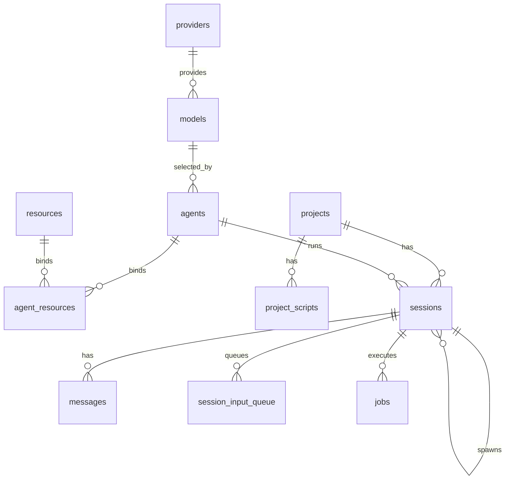

# 数据库结构

本文记录当前运行时实际创建的 SQLite 结构。权威实现位于
`packages/supervisor/src/db/db.ts`、`core/project-scripts.ts` 与 `core/jobs.ts`；修改表结构时应同步本文。

时间字段均为 Unix 毫秒。SQLite 中的布尔值使用 `INTEGER`（0/1），JSON 使用 `TEXT` 保存。

## 表总览

| 表                              | 用途                                    |
| ------------------------------- | --------------------------------------- |
| `providers` / `models`          | 模型供应商与模型目录                    |
| `agents`                        | 可选择的 Agent 配置                     |
| `projects` / `project_scripts`  | 项目及 install/start/destroy 脚本       |
| `sessions`                      | 会话、派生关系和运行状态                |
| `messages` / `messages_fts`     | 消息树与全文索引                        |
| `session_input_queue`           | 会话输入队列                            |
| `todo_task`                     | Todo 任务树（规划 / 确认 / 执行）       |
| `resources` / `agent_resources` | skill、MCP、extension 资源及 Agent 绑定 |
| `jobs`                          | Session 执行记录                        |

旧表 `extensions`、`members`、`session_tasks`、`session_todos`、`job_schedules` 会在迁移后删除。

## 核心配置表

### `providers`

`id INTEGER PK`、`slug TEXT UNIQUE`、`name TEXT NOT NULL`、`icon TEXT`、
`protocol TEXT NOT NULL`、`base_url TEXT`、`api_key TEXT`、
`is_enabled INTEGER NOT NULL DEFAULT 1`、`created_at`、`updated_at`。

### `models`

`id INTEGER PK`、`provider_id INTEGER NOT NULL`（级联删除）、`model_id TEXT NOT NULL`、
`name TEXT`、`context_window INTEGER NOT NULL DEFAULT 128000`、
`supports_vision INTEGER NOT NULL DEFAULT 0`、`created_at`、`updated_at`。
`(provider_id, model_id)` 唯一。

### `agents`

| 列                          | 类型/默认值                    | 说明                                       |
| --------------------------- | ------------------------------ | ------------------------------------------ |
| `id`                        | INTEGER PK                     | Agent ID                                   |
| `name`                      | TEXT NOT NULL                  | 显示名                                     |
| `description` / `avatar`    | TEXT                           | 展示字段                                   |
| `backend_type`              | TEXT NOT NULL DEFAULT `native` | `native`、`codex`、`claude`、`kimi`、`acp` |
| `model_id`                  | INTEGER FK                     | 指向 `models.id`，删除模型时置空           |
| `system_prompt`             | TEXT                           | Agent system prompt 正文                   |
| `tools_preset`              | TEXT NOT NULL DEFAULT `coding` | `coding`、`readonly`、`none`               |
| `home_dir`                  | TEXT                           | Agent 专属目录                             |
| `is_builtin`                | INTEGER DEFAULT 0              | 内置标志                                   |
| `external_config`           | TEXT                           | 外部 Agent 配置 JSON                       |
| `meta`                      | TEXT DEFAULT `{}`              | 扩展命名空间数据及旧配置兼容读取           |
| `created_at` / `updated_at` | INTEGER                        | 时间                                       |

`external_config` 的当前形状为 `{ command, args?, env?, permissionPolicy? }`。模型只通过
`model_id -> models -> providers` 解析。华生使用内部 runner 与 `featureModels.assistant`，不创建用户 Session。

### `projects`

`id INTEGER PK`、`name TEXT NOT NULL`、`description TEXT`、`cwd TEXT NOT NULL UNIQUE`、
`home_dir TEXT NOT NULL`、`created_at`、`updated_at`。

`cwd` 是源码目录；`home_dir` 是 Supervisor 管理的 Project 专属目录。当前物理表没有 `meta` 列。

### `project_scripts`

`id INTEGER PK`、`project_id INTEGER NOT NULL`（级联删除）、`kind TEXT NOT NULL`、
`name TEXT NOT NULL`、`command TEXT NOT NULL`、`created_at`、`updated_at`。
`kind` 当前使用 `install`、`start`、`destroy`。

## Session 与消息

### `sessions`

| 列                                   | 类型/默认值                 | 说明                                          |
| ------------------------------------ | --------------------------- | --------------------------------------------- |
| `id`                                 | INTEGER PK                  | Session ID                                    |
| `project_id`                         | INTEGER FK nullable         | 所属项目，级联删除                            |
| `parent_id`                          | INTEGER FK nullable         | 父 Session，删除时置空                        |
| `status`                             | TEXT DEFAULT `initializing` | 生命周期状态；需介入时为 `blocked`            |
| `thinking_level`                     | TEXT DEFAULT `none`         | 思考等级                                      |
| `cwd`                                | TEXT DEFAULT 空串           | 当前工作目录                                  |
| `leaf_id`                            | TEXT                        | 当前消息分支叶子                              |
| `agent_id`                           | INTEGER FK nullable         | 只从 Agent 解析模型与 tools preset            |
| `spawn_type`                         | TEXT                        | `subagent`、`btw`、`fork`、`clone` 等派生类型 |
| `created_by`                         | TEXT DEFAULT `user`         | 创建来源                                      |
| `title` / `system_prompt` / `avatar` | TEXT                        | 会话快照/展示字段                             |
| `is_builtin`                         | INTEGER DEFAULT 0           | 内置会话                                      |
| `pinned` / `muted` / `unread`        | INTEGER                     | 核心 UI 状态                                  |
| `external_session_id`                | TEXT                        | 外部运行时 Session ID                         |
| `error_msg`                          | TEXT                        | 可展示的 blocked/error 原因                   |
| `stage`                              | TEXT                        | 当前工作流阶段；不再使用 `meta.workflow`      |
| `shadow_enabled`                     | INTEGER DEFAULT 0           | Shadow 开关                                   |
| `created_at` / `last_active_at`      | INTEGER                     | 时间                                          |
| `meta`                               | TEXT DEFAULT `{}`           | Session 扩展状态                              |

### `sessions.meta`

核心身份与 UI 字段必须写专用列。当前核心/内置扩展识别以下键：

| 键              | 形状/归属                                                                             |
| --------------- | ------------------------------------------------------------------------------------- |
| `tasks`         | `{ id, path, kind, title, status, createdAt, updatedAt }[]`                           |
| `currentTask`   | 当前 task path 或 `null`                                                              |
| `todos`         | `{ id, title, status, sortOrder }[]`                                                  |
| `subagentIds`   | 当前 Session 可委派的 Agent ID 白名单                                                 |
| `git`           | `{ worktreePath, branch, lastCommit, mergeError }`；有 `worktreePath` 即启用 worktree |
| `services`      | Project scripts 启动后的 Session 服务实例、端口与状态                                 |
| `shadow`        | Shadow 输出，例如 `suggestedQuestions`                                                |
| `timers`        | Timer 定义；触发执行记录写 `jobs`                                                     |
| `compaction`    | rolling compaction 配置/快照                                                          |
| `toolLoopGuard` | 工具循环守卫状态                                                                      |
| `changedFiles`  | turn 文件变更跟踪                                                                     |

用户扩展键应带命名空间，例如 `strictSdd.status` 或 `myExt.*`。不要把仅因工具 `cwd`
产生的产物写进项目目录；按 Session > Agent/Project 的最具体归属选择专属目录。

### `messages`

`id INTEGER PK`、`entry_id TEXT NOT NULL UNIQUE`、`session_id INTEGER NOT NULL`（级联删除）、
`parent_entry_id TEXT`、`type TEXT NOT NULL`、`payload TEXT NOT NULL`、`meta TEXT DEFAULT {}`、
`is_old INTEGER DEFAULT 0`、`origin_msg TEXT`、`role TEXT`、`search_text TEXT`、`created_at`。

`payload` 是权威 entry；`role` 与 `search_text` 是查询/FTS 派生列；`origin_msg` 保存 slash
展开等改写前的用户输入。`messages.meta.assets` 保存
`{ scope: "project" | "agent" | "session", path, name?, mediaType? }[]`；
`liteTruncated` 表示列表接口裁剪过内容。扩展可保存其它消息级命名空间键。

`messages_fts(search_text, role, session_id UNINDEXED, message_id UNINDEXED)` 由触发器同步，
其中 `message_id` 对应 `messages.entry_id`。

### `session_input_queue`

`id TEXT PK`、`session_id INTEGER NOT NULL`、`message TEXT NOT NULL`、`level INTEGER NOT NULL`、
`origin_msg TEXT`、`images TEXT`、`enqueued_at INTEGER NOT NULL`。按
`(session_id, level DESC, enqueued_at ASC)` 索引。

## 任务、资源与执行

### `todo_task`

`id INTEGER PK`、`title TEXT NOT NULL`、`description TEXT DEFAULT ''`、`project_id INTEGER`、
`status TEXT DEFAULT todo`、`priority TEXT DEFAULT normal`、`parent_id INTEGER`、
`session_id INTEGER`、`agent_id INTEGER`、`depends_on TEXT DEFAULT []`、
`subagent_ids TEXT DEFAULT []`、`phase TEXT DEFAULT draft`、`error TEXT`、
`created_at`、`updated_at`。旧表名 `home_tasks` 会在启动时迁移为 `todo_task`。

### `resources` 与 `agent_resources`

`resources`：`id`、`kind`、`slug`、`name`、`description`、`source_path`、`version`、
`meta TEXT DEFAULT {}`、`created_at`、`updated_at`，且 `(kind, slug)` 唯一。
内置资源使用 `meta.builtin: true`；资源类型的其它数据可存各自命名空间。

`agent_resources`：`id`、`agent_id`、`resource_id`、`enabled DEFAULT 1`、
`priority DEFAULT 0`、`created_at`，且 `(agent_id, resource_id)` 唯一。

### `jobs`

`id TEXT PK`、`session_id INTEGER NOT NULL`、`kind`、`name`、`label`、`status`、
`execution_mode`、`parent_job_id`、`capabilities TEXT DEFAULT []`、`output TEXT DEFAULT ''`、
`progress TEXT`、`result TEXT`、`error TEXT`、`metadata TEXT DEFAULT {}`、
`created_at`、`started_at`、`finished_at`。

Job 是执行记录，不是定时定义。`metadata` 按 kind 保存必要执行信息，例如 bash 的
`command/cwd/pid/exitCode` 或 timer fire 的 `timerId/firedAt`。

## 关系

